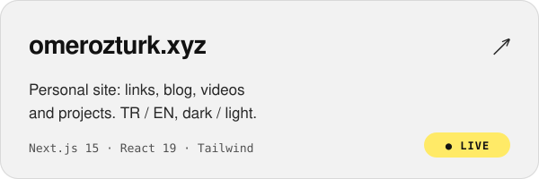
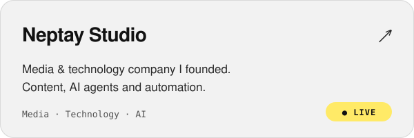
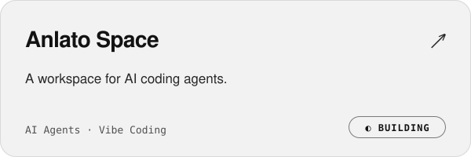
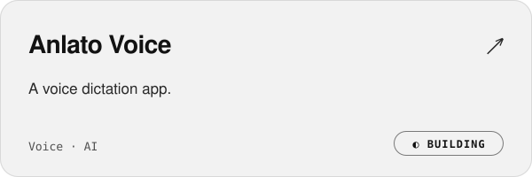

<a href="https://omerozturk.xyz">
  <picture>
    <source media="(prefers-color-scheme: dark)" srcset="assets/banner-dark.svg">
    
  </picture>
</a>

  
  
  
  
  
  

### 👋 Merhaba, ben Ömer

Yapay zekâyla üretiyor, öğrendiklerimi paylaşıyorum. Vibe coding ile uygulamalar ve web siteleri geliştiriyorum; hepsini kurucusu olduğum [**Neptay**](https://neptay.com) çatısı altında yapıyorum.

> **EN —** I build apps and websites through vibe coding, create content on generative AI and AI-powered ventures, and run it all under [Neptay](https://neptay.com), the company I founded.

### 🛠️ Projeler · Projects

<table>
  <tr>
    <td width="50%">
      <a href="https://omerozturk.xyz">
        <picture>
          <source media="(prefers-color-scheme: dark)" srcset="assets/project-omerozturk-dark.svg">
          
        </picture>
      </a>
    </td>
    <td width="50%">
      <a href="https://neptay.com">
        <picture>
          <source media="(prefers-color-scheme: dark)" srcset="assets/project-neptay-dark.svg">
          
        </picture>
      </a>
    </td>
  </tr>
  <tr>
    <td width="50%">
      <a href="https://neptay.com">
        <picture>
          <source media="(prefers-color-scheme: dark)" srcset="assets/project-anlato-space-dark.svg">
          
        </picture>
      </a>
    </td>
    <td width="50%">
      <a href="https://neptay.com">
        <picture>
          <source media="(prefers-color-scheme: dark)" srcset="assets/project-anlato-voice-dark.svg">
          
        </picture>
      </a>
    </td>
  </tr>
</table>

### 📺 Kanallar · Channels

| | Kişisel · Personal | AI |
| --- | --- | --- |
| **Konu · Topics** | Genel · Girişim · Gelişim | Generative AI · Vibe Coding · Solo Girişimcilik |
| **YouTube** | [@omerozturkxyz](https://www.youtube.com/@omerozturkxyz) | [@omerozturkai](https://www.youtube.com/@omerozturkai) |
| **Instagram** | [@omerozturk.xyz](https://instagram.com/omerozturk.xyz) | [@omerozturk.ai](https://instagram.com/omerozturk.ai) |

### ⚡ Araçlar · Toolbox

  
  
  
  
  
  
  

### ☕ Destek · Support

Paylaşımlarımı faydalı buluyorsan bir kahve ısmarlayarak destekleyebilirsin.

---

Neptay Studio'da yapıldı · Made at <a href="https://neptay.com">Neptay Studio</a>

