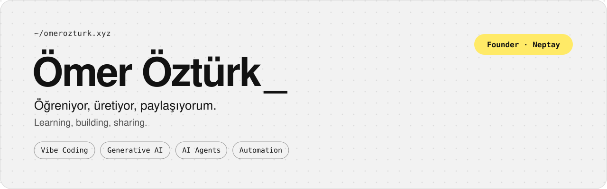

<a href="https://omerozturk.xyz">
  <picture>
    <source media="(prefers-color-scheme: dark)" srcset="assets/banner-dark.svg">
    
  </picture>
</a>

  
  
  
  
  
  

### 👋 Hi, I'm Ömer

I build with AI and share what I learn along the way. I'm the founder of [**Neptay**](https://neptay.com), a media and technology company, and I spend most of my days turning ideas into working apps and websites through vibe coding.

### 🧭 What I'm into

- **Vibe coding.** Shipping real products by pairing with AI coding agents, from first prompt to production.
- **AI agents & automation.** Building agents and workflows that take repetitive work off people's plates.
- **Generative AI.** Testing new models and tools, and figuring out what actually holds up in day-to-day work.
- **Building in public.** Sharing the process, the wins and the dead ends on my channels.

### 📺 Where to find me

I make content on generative AI, vibe coding and the ventures I build with AI.

| Platform | Handle |
| --- | --- |
| **YouTube** | [@omerozturkai](https://www.youtube.com/@omerozturkai) |
| **Instagram** | [@omerozturk.ai](https://instagram.com/omerozturk.ai) |
| **Kick** | [omerozturkxyz](https://kick.com/omerozturkxyz) |
| **X** | [@omerozturkxyz](https://x.com/omerozturkxyz) |

### ⚡ Toolbox

  
  
  
  
  
  
  

### ☕ Support

If you find what I share useful, you can support me with a coffee.

---

Made at <a href="https://neptay.com">Neptay Studio</a>

